# code-mind 技术设计

> 五层 Agent 技能库：把「需求 → 设计 → 编码 → 测试」切成互不越权的职责层，通过 junction 共源安装到 Cursor / Qoder / Trae / WorkBuddy。




## 1. 分层职责

| 层 | 技能 | 只做 | 不碰 |
|----|------|------|------|
| L-WHAT | RequirementMind | 澄清需求、批量追问、冻结 FROZEN 决策 | 不写代码、不画实现图 |
| L-HOW | DiagramMind | 分析取证 → 选图型 → 出图 → drift 基线 | 不问 WHAT、不改代码 |
| L-DO | ai-code | 最小 diff + 自检 | 不改 FROZEN、不重画图 |
| 横切 | concise-mind | 压缩输出、去废话 | 不改语义 |
| 契约 | shared/ | 定义层与路由、交接结构 | 不含任何业务实现 |

**核心不变量**：下层不得修改上层的真源。上层可被跳过（micro-fix 跳过设计层），但跳过必须留一行可证伪的判据。

## 2. 工件链（下游 AI 直接消费）

| # | 生产者 | 工件 | 落盘位置 | 消费者 |
|---|--------|------|----------|--------|
| 1 | RequirementMind | FROZEN 决策 + 验收判据 | `.requirementmind/*.json` | DiagramMind / ai-code |
| 2 | DiagramMind | **本文件**（1 张架构图 + 设计约束） | `docs/diagram/design.md` | ai-code |
| 3 | DiagramMind | drift 基线 | `.diagramdrift.json` | drift.mjs |
| 4 | ai-code | 最小 diff + Change Manifest | 工作树 + 变更说明 | 人 / 测试层 |

交接结构由 `shared/handoff-schema.yaml` 定义，机器校验入口 `scripts/validate_handoff.py`。

## 3. 命令

| 命令 | 作用 | 何时用 |
|------|------|--------|
| `/ai-requirement` | 需求澄清 → FROZEN | 需求模糊 / 多解读 |
| `/ai-design` | 出图（本文档的图） | 需要「一图看懂」或架构有变更 |
| `/ai-code` | 最小 diff + 自检 | WHAT 已冻 |
| `/concise-mind` | 压缩输出 | 输出太啰嗦 |
| `render.mjs <目录>` | 渲染图 | 图源变更后 |
| `render.mjs --check` | 探测工具链 | 首次 / 渲染失败 |

## 4. 风险

| # | 风险 | 级别 | 影响 | 处置 |
|---|------|------|------|------|
| 1 | Mermaid 渲染依赖本机 Chrome | 中 | 无浏览器环境不可出图 | `--check` 前置；失败降级为纯 DSL 并标注 |
| 2 | D2 经 worker 调 WASM，崩溃无堆栈 | 中 | 失败难定位 | 回传 `err.message`；`evals/` 保留样例 |
| 3 | `ai-skill-mcp-Y` 未进 junction manifest | 低 | 该 skill 未安装到任何宿主 | 确认后加入 `skill_junctions` |

## 5. 未知 / 待确认

| # | 问题 | 状态 | 需要 |
|---|------|------|------|
| 1 | 宿主是否消费旧 Handoff 路径 | 未知 | 查宿主 `.agent/state/` |
| 2 | 设计层产物是否需进 CI 卡口 | 未知 | 查 `.github/workflows` |
| 3 | ai-code 是否强制消费本文件 | 待确认 | 查 `ai-code/SKILL.md` G0 |

## 6. 本次变更面

设计层（L-HOW）`skills/ai-design` 由 Handoff 规划改为 DiagramMind 图生成；契约层 `shared/core.md` 的 L-HOW 行与工件链同步；下游 `skills/ai-code` 的 G0 改消费本文件。

## 7. 验收

| # | 判据（可 TDD 化） | 证据 |
|---|------------------|------|
| 1 | `render.mjs --check` 退出码 == 0 | 已跑，exit=0 |
| 2 | `render.mjs docs/diagram` 产出 svg 数 == 1 | 已跑，1 个（一文一图） |
| 3 | 重复跑 `render.mjs docs/diagram` 全量跳过 | 已跑，skipped=1 |
| 4 | `validate_handoff.py docs/diagram/design.md` 退出码 == 0 | 见下方命令输出 |
| 5 | `grep -r "handoff-template" skills/ shared/ scripts/ README.md` 无命中 | 已跑，无命中 |

```yaml
变更面: skills/ai-design 设计层 + 契约层 core.md + ai-code G0
plan路径: "@docs/diagram/design.md"
范围: ai-design 渲染器与主题 / core.md L-HOW 行 / ai-code G0 消费点
验收: 验收表 #1-#5 可独立测
验证档位: surface
建议下一步: /ai-code
```
