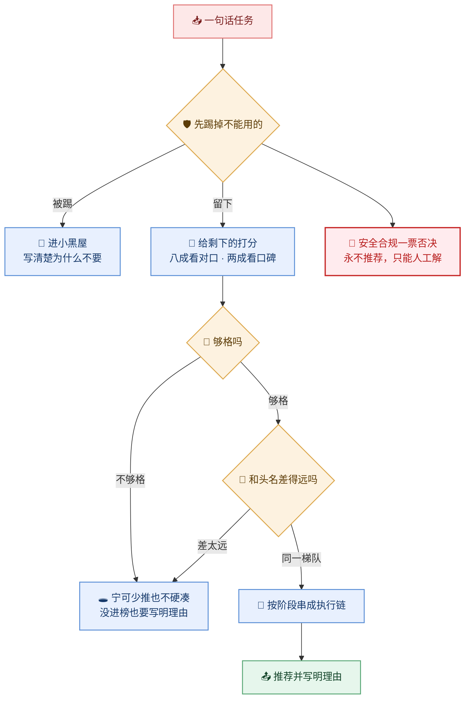

# 一个任务进来，技能是怎么被挑出来的

> 回答「为什么推荐这个 skill 而不是那个」——筛选在前、打分在后，两道闸门 + 一条同量级带。
> 给要复核路由结果的人看；权重细节与反模式清单不在这张图里。




## 0. 节点证据

| 图节点 | 证据 |
|--------|------|
| 一句话任务 | `skills/ai-skill-mcp-Y/references/router.md:20-32`（输入：CLI + 注册表 + 控制面 + 历史分） |
| 先踢掉不能用的 | `router.md:67-75`（硬过滤五条，**先于打分**） |
| 给剩下的打分 | `router.md:90-115`（`route_score` 五项加权） |
| 够格吗 | `router.md:117-121`（过阈值 **且** 至少一条相关性信号） |
| 和头名差得远吗 | `router.md:123-130`（同量级带 `RELATIVE_BAND = 0.45`） |
| 按阶段串成执行链 | `router.md:132-149`（category → phase，**禁硬编码技能名**） |
| 推荐并写明理由 | `router.md:34-65`（输出契约；`reasons` 必须可解释，标签即证据） |
| 进小黑屋 | `router.md:69-71`（进 `excluded` 并写明理由） |
| 🛑 安全合规一票否决 | `router.md:69`（`status == blocked`：永不推荐，只能人工解除） |
| 🕳️ 宁可少推也不硬凑 | `router.md:121`（全部不满足 → `recommended = []` + warning） |

## 1. 硬过滤五条（`router.md:67-75`，先于打分）

| 情况 | 处理 |
|------|------|
| `status == blocked` | 进小黑屋，**永不推荐**（只能人工解除） |
| 触发排除词命中任务原文 | 进小黑屋，记「排除词命中：X」 |
| 已废弃 **且** 有替代 | 进小黑屋，记「已有替代 X」 |
| 已废弃 **且** 无替代 | **仍推荐**，但追加标注 + 告警 |
| `--risk critical` 且技能 `risk == high` | 降级为候选 + 告警；`--confirm-risk` 可解除 |

**先过滤后打分**是硬要求 —— 反过来会让被封杀的技能先污染排序。

## 2. 打分：八成看对口，两成看口碑

`router.md:93`：

| 分项 | 权重 | 怎么算满 |
|------|------|---------|
| 标签 / 关键词 | 0.45 | 命中 ≥2 个即满分 |
| 触发词 | 0.25 | 任一命中即满分 |
| 项目类型匹配 | 0.15 | category 对上记满分，否则 0 |
| 历史成功率 | 0.10 | `score/100`，无记录记 0 |
| 上下文成本 | 0.05 | `1 - root_lines/400`，400 行扣满 |

前三项（0.85）是"这件事对不对口"，后两项（0.15）是"这个技能靠不靠谱"——**口碑再好也不能顶掉对口的**，所以权重压到 0.15。

## 3. 两道闸门 + 一条同量级带

| 关卡 | 条件 | 挡掉什么 |
|------|------|---------|
| ① 够格吗 | 分数 ≥ `--min-confidence`（默认 0.12）**且** 至少一条相关性信号 | 只靠历史分 + 上下文成本进榜 = 无依据推荐 |
| ② 和头名差得远吗 | 分数 ≥ 头名 × 0.45 | 通用词偶然命中的噪声 |

**同量级带 0.45 专治两类噪声**（`router.md:126-130` 实测）：

| 噪声源 | 实测 | 为什么是噪声 |
|--------|------|------------|
| 只靠项目类型命中 | 治理任务里某技能仅凭 `category` 拿 0.18 | 同 category ≠ 同职责，零标签/触发词命中 |
| 单个中文二字窗口 | 靠描述里的「审计」二字拿 0.25 | 通用词偶然命中，不是相关性 |

取值依据：真正需要多技能协同的任务比值约 0.84，远高于 0.45；被挡掉的都是比值 < 0.45 的项。

## 4. 链装配：顺序即执行顺序

`需求澄清 → 设计 → 编码 → 验证`（`router.md:132-149`）。

- 阶段由 **category → phase** 推导，**禁止硬编码技能名**（注册表一变链就错）；
- 链成员只能来自已过闸门的推荐，每阶段取分最高；
- 任务里出现「已冻结 / 已确认 / 已定稿」→ 该阶段视为已完成，不再进链；
- 一个阶段都认不出来 → `chain = []` + 告警，**不硬装链**。

## 5. 命令

| 何时 | 命令 |
|------|------|
| 人读 | `python3 scripts/router.py --task "改一个 MyBatis SQL"` |
| 机读 | `python3 scripts/router.py --task "..." --json` |
| 回归 | `tests/routing-cases.json`（12 条金标，`expect_top` / `expect_not`） |

退出码：`0` 路由完成（**含"无命中"**）· `1` 执行失败 · `2` 用法或环境错误。

## 6. 风险

| # | 风险 | 级别 | 影响 | 处置 |
|---|------|------|------|------|
| 1 | 先打分后过滤 | 高 | 被封杀技能污染排序 | 硬过滤先行 |
| 2 | 推荐不带理由 | 高 | 无法审计复核 | `reasons` 非空是硬断言 |
| 3 | 无命中时硬凑一个 | 中 | 假阳性比"没有"更贵 | 空 + 告警 |
| 4 | 把否定从句当正向关键词 | 中 | 跨域误触发头号来源 | `Not for` 之后不进关键词面 |
| 5 | 声称跑过未实现的高级路由 | 中 | 静默降级即造假 | 必须回落到规则级并告警 |

## 7. 未知 / 待确认

| # | 问题 | 状态 | 需要 |
|---|------|------|------|
| 1 | 二~四级路由（Embedding / LLM / 多专家）均未实现 | 已知 | 见 `router.md:150-159` 启用条件 |
| 2 | `RELATIVE_BAND` 是否需按项目校准 | 未知 | 积累路由日志后回归 |

## 8. 验收

| # | 判据 | 证据 |
|---|------|------|
| 1 | `node scripts/lint.mjs docs/diagram/skill-routing.md` 退出码 0 且 fail=0 | 待跑 |
| 2 | 图上无类名 / 路径 / 行号，证据全在 §0 | 由 #1 的 P11 覆盖 |
| 3 | 节点 ≤12、边 ≤14、画布宽 ≤1200 | 由 #1 的 P02/P03 覆盖 |

```yaml
变更面: 文档层 · 设计交付物（无代码改动）
plan路径: "@docs/diagram/skill-routing.md"
假设: 复核路由结果的人需要看懂"为什么是它"，而不是读权重公式
范围: docs/diagram 交付物；不含任何源码
验收: 验收表 #1-#3
验证档位: micro-fix
待代码确认: 无
规则演进: 无
建议下一步: 无
接入门: 跳过(本任务不涉数据库与服务器读写)
identity_matrix: na
verification_escalation: na
```
