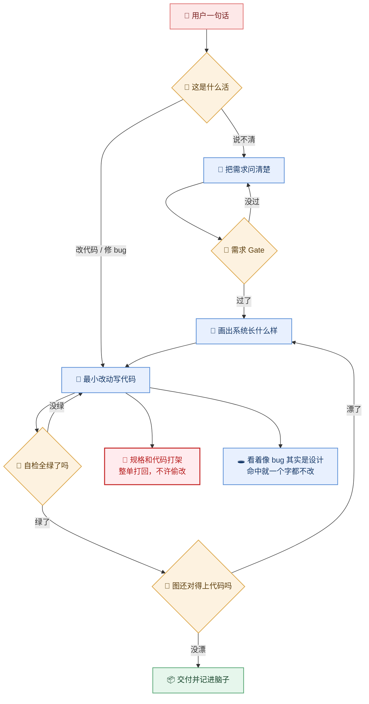

# 一次 AI 编码任务怎么走完全程

> 一句话需求进来后，系统按什么顺序做决定、以及**在什么情况下会被打回**。
> 给刚接手这套 skill 的人看；每个 skill 内部的细节不在这张图里。




## 0. 节点证据

| 图节点 | 证据 |
|--------|------|
| 用户一句话 → 判活 | `shared/core.md:21-33`（五层路由表，按信号选首挂） |
| 把需求问清楚 | `shared/core.md:14`（L-WHAT，未 READY 禁止正式开发） |
| 需求 Gate | `shared/core.md:46`（`state.mjs gate .requirementmind`） |
| 画出系统长什么样 | `shared/core.md:47`；`skills/ai-design/SKILL.md` |
| 最小改动写代码 | `skills/ai-code/SKILL.md` G0–G5 |
| 自检全绿了吗 | `skills/ai-code/SKILL.md`「G4 VERIFY … 未绿→G0」 |
| 图还对得上代码吗 | `shared/core.md:52`；`scripts/verify_skill_drift.py` |
| 交付并记进脑子 | `shared/core.md:53-54`（Change Manifest → `record_task_outcome`） |
| 🛑 规格和代码打架 | `shared/core.md:37`（FROZEN ≠ 代码 → `DEVELOPMENT_BLOCKER` 回 RM，**禁 ai-code 私裁**） |
| 🕳️ 看着像 bug 其实是设计 | `shared/core.md:263-274`（假阳性 F1–F10）；`shared/core.md:365`（环绿且属 F1 → **改动为零**） |

## 1. 五路路由（图上 B 节点展开）

图里只画了两条出口，剩下三条在这里 —— 它们是**入口选择**，不是主链的一部分。

| 信号 | 首挂 | 别叠 |
|------|------|------|
| 模糊 / 多解读 / 未钉金标 | RequirementMind（未 Gate 时） | `/ai-code` |
| **Gate 已 READY 且 HOW 未钉** | `/ai-design` | 再开需求追问 |
| Gate 已 READY、需求清楚 | **跳过澄清直接进设计** | — |
| 改 Java / SQL / 修 bug | `/ai-code` | 需求追问 |
| 一直修不好 | `/ai-code` DBG 段 | 未复现就改 |
| 「当初为啥这么定」 | brain `search_project_context` | 当代码图用 |

micro-fix（typo / 唯一解读）可跳澄清与设计，但**必须留一行可证伪的判据**（`shared/core.md:56`）。

## 2. 三条打回回路（本图的核心）

| # | 从 | 回 | 触发 | 依据 |
|---|----|----|------|------|
| 1 | 需求 Gate | 把需求问清楚 | Gate 未过（BLOCKED） | `shared/core.md:24` |
| 2 | 自检全绿了吗 | 最小改动写代码 | 未绿 → 回 G0 判据 | `skills/ai-code/SKILL.md` G4 |
| 3 | 图还对得上代码吗 | 画出系统长什么样 | drift 检出漂移 | `shared/core.md:58-60` |

**回流是常态不是异常** —— 三条回路都在设计内，不要当成故障去"修"。

## 3. 两个刹车点（图上 K1 / K2）

图只回答"怎么跑的、卡在哪"，这两个是最容易被忽略的卡点，所以挂在旁边：

- **K1 规格和代码打架**：FROZEN 决策与代码/SQL 不一致 → 发 `DEVELOPMENT_BLOCKER` 回 RequirementMind。**禁止 ai-code 自己判断取舍**（`shared/core.md:37`）。
- **K2 看着像 bug 其实是设计**：命中 F1–F10（生命周期回流、环境错位、乐观更新、幂等重复提交…）→ 结论是"非缺陷"，**代码改动为零**（`shared/core.md:365`）。

## 4. 验证档位（自检那一格按什么标准）

来源 `shared/verification-policy.yaml:14-19`（风险 → Gate 映射）：

| 档 | 必跑 |
|----|------|
| R0 | format |
| R1 | build + targeted_tests |
| R2 | build + tests + scenario_matrix |
| R3 | R2 + independent_review |
| R4 | R3 + human_approval |

风险下限：鉴权 / 支付 / 权限模型 / DB 迁移 ≥ R3；生产配置 ≥ R4。
**反模式**：`compile 绿` ≠ `行为正确` —— 过滤/权限类必须跑身份 × 入参全矩阵。

## 5. 工件链

| # | 生产者 | 工件 | 落盘 | 消费者 |
|---|--------|------|------|--------|
| 1 | RequirementMind | `DEVELOPMENT_SPEC.md` + IR yaml | `.requirementmind/` | `/ai-design` |
| 2 | `/ai-design` | 系统图 + `design.md`（含 `design_to_code` YAML） | `docs/diagram/` | `/ai-code` |
| 3 | 校验脚本 | Handoff 合格证明 | `python scripts/validate_handoff.py` | `/ai-code`（**不过禁止消费**） |
| 4 | `/ai-code` | 最小 diff + Change Manifest | 工作区 | 人 / brain |
| 5 | brain | `record_task_outcome` | brain | 下次任务 |

## 6. 命令

| 何时 | 命令 |
|------|------|
| 需求出口 | `node $SKILL/scripts/state.mjs gate .requirementmind` |
| 出图前预检 | `node scripts/lint.mjs docs/diagram/` |
| 渲染 | `node scripts/render.mjs docs/diagram/ --strict` |
| Handoff 校验 | `python scripts/validate_handoff.py docs/diagram/design.md` |
| drift | `python scripts/verify_skill_drift.py` |

## 7. 风险

| # | 风险 | 级别 | 影响 | 处置 |
|---|------|------|------|------|
| 1 | 三条回流被当成 bug 去"修"，改坏正常链路 | 高 | 回流被误删 | 回流在设计内，见 §2 |
| 2 | FROZEN 与代码冲突被 ai-code 私下裁决 | 高 | 决策被绕过 | 强制 BLOCKER 回 RM |
| 3 | 假阳性未证伪就改码 | 中 | 改动为零却产生 diff | 先过 F1–F10 |
| 4 | 验证档位选低了 | 中 | 权限/过滤类漏测 | 按 §4 风险下限升档 |

## 8. 未知 / 待确认

| # | 问题 | 状态 | 需要 |
|---|------|------|------|
| 1 | DBG 段（一直修不好）在图里被并进"改代码 / 修 bug"，未单独展开 | 已知简化 | 需要时另开一份文档 |
| 2 | drift 检测是否已进 CI | 未知 | 查 `.github/workflows` |

## 9. 验收

| # | 判据 | 证据 |
|---|------|------|
| 1 | `node scripts/lint.mjs docs/diagram/task-routing.md` 退出码 0 且 fail=0 | 待跑 |
| 2 | 图上无类名 / 路径 / 行号；代码锚点全在 §0 | 待跑（由 #1 的 P11 覆盖） |
| 3 | 节点 ≤12、边 ≤14、画布宽 ≤1200 | 待跑（由 #1 的 P02/P03 覆盖） |

```yaml
变更面: 文档层 · 设计交付物（无代码改动）
plan路径: "@docs/diagram/task-routing.md"
假设: 新人看不懂"一句话需求进来后到底怎么走、为什么老被打回"，需要一张主链清晰的图
范围: docs/diagram 交付物；不含任何源码
验收: 验收表 #1-#3
验证档位: micro-fix
待代码确认: 无
规则演进: 无
建议下一步: 无
接入门: 跳过(本任务不涉数据库与服务器读写)
identity_matrix: na
verification_escalation: na
```
