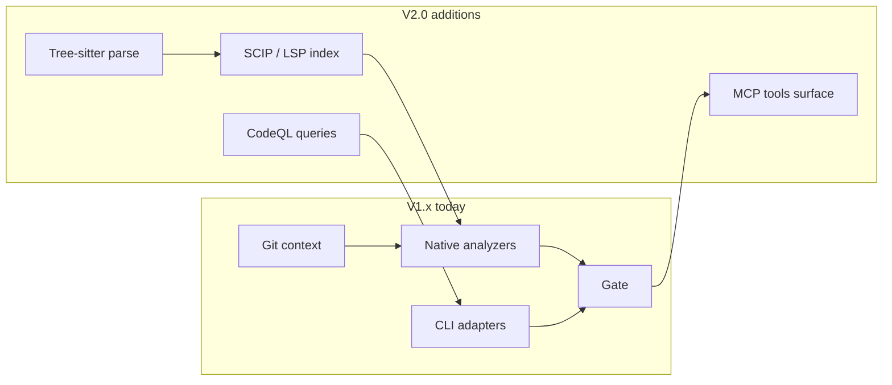

# ADR-004: V2.0 Code Intelligence Roadmap

**Status:** Accepted (roadmap — not yet implemented)  
**Date:** 2026-09-16  
**Context:** CodeHealthMind Ultimate V2.0 design doc; reference trees under `C:\Users\Administrator\Downloads\代码` (CodeQL, Semgrep, tree-sitter, SCIP, codemind).

## Decision

Ship **V1.x** as the current stack: git context → **native-java/vue** deterministic analyzers → optional **CLI adapters** (PMD, CPD, SpotBugs, Semgrep, Knip, javac) → normalizer → validator → gate.  
**V2.0** adds a **Code Intelligence** layer *without* vendoring reference-project source (see ADR-002).

## V1.x (today — shipped)

| Layer | What runs | Role |
|-------|-----------|------|
| Context | `gitctx`, `packer`, symbol index (AST-lite) | Deterministic change set + isolated reviewer pack |
| Native | `native-java`, `native-vue` | Pattern-provable rules offline; 50+ `CHM-*-NAT-*` ids |
| Adapters | PMD/CPD/SpotBugs/Semgrep/Knip/javac | Real tool evidence when toolchain present |
| Gate | score + baseline + `UNKNOWN` on evidence gaps | No fake green when tools missing |

## V2.0 (planned — incremental)

Priority order matches dependency and ROI:

| Capability | Borrow from reference | Integration shape | Gate impact |
|------------|----------------------|-------------------|-------------|
| **Tree-sitter** | Parse trees for Java/JS/Vue | Replace regex skeleton for *new* rules only; native rules stay until migrated | Sharper line/symbol evidence |
| **SCIP** | Cross-file defs/refs | `context/symbols` upgrade path; feed dedup + dead-code | Fewer false positives on unused |
| **CodeQL** | Query packs | New adapter `codeql` (SARIF in); opt-in per repo | Security + deep dataflow HIGH |
| **Semgrep** | Already adapter | Harden rules under `rules/{java,common,shejiu}` | Pattern HIGH with local rules |
| **MCP** | codemind-style exposure | `review` / `probe` / `baseline` as MCP tools | IDE agents call gate without shell |
| **Health score / drift** | V2 doc metrics | Extend `score.py` + baseline delta | WARN on regression trends |

**Explicitly not in V2.0 scope:** copying reference repos into this skill; running CodeQL on every diff by default; replacing native analyzers in one big bang.

## Migration principles

1. **Adapter-first** — new engines appear as `EvidenceProvider` + SARIF/json normalizer; orchestrator order unchanged.
2. **Native coexistence** — native rules remain until a V2 rule proves strictly better on golden + adversarial suites.
3. **Offline default** — no `auto` Semgrep/CodeQL rulesets; repo-local or pinned toolchain only (ADR-003).
4. **Evidence contract frozen** — `docs/finding-schema.md` and gate semantics do not change without ADR.

## Acceptance for V2 milestones

| Milestone | Done when |
|-----------|-----------|
| M1 Tree-sitter | One native rule migrated; golden suite still 481+ pass |
| M2 SCIP index | Unused-field FPR drops on `java-dead-code` fixture |
| M3 CodeQL adapter | SARIF → findings; missing CodeQL → `UNKNOWN` not PASS |
| M4 MCP | `codehealth probe` + `review --diff` exposed as MCP; schema documented |

## References

- ADR-002 — reference project usage (no source copy)
- ADR-003 — toolchain degradation / `UNKNOWN`
- `docs/architecture.md` §7 — current reference borrow list
