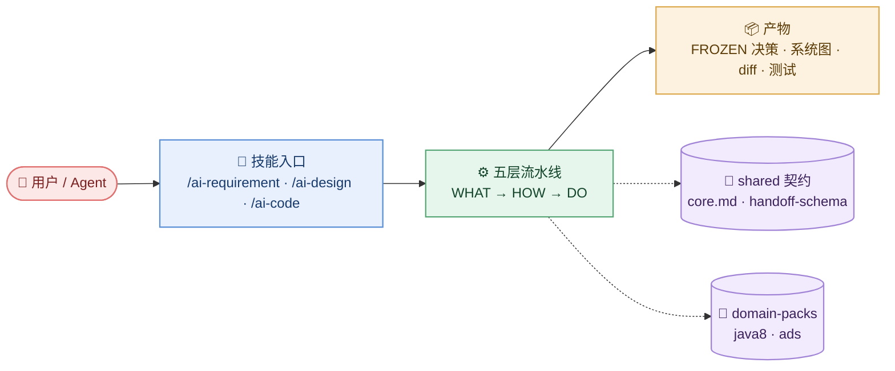

# 系统总览

> code-mind 是一套把「需求 → 设计 → 编码 → 测试」切成五层职责的 Agent 技能库，通过 junction 共源安装到 Cursor / Qoder / Trae / WorkBuddy。

## 说明

- **入口只有两类**：斜杠命令（`/ai-requirement` `/ai-design` `/ai-code` `/concise-mind`）与自动触发（按 description 匹配）。
- **五层是职责切分，不是调用链**：上层可被跳过（micro-fix 跳过设计层），但下层不得改上层真源。
- **shared/ 是唯一契约源**（虚线）：`core.md` 定义层与路由，`handoff-schema.yaml` 定义交接结构。
- **domain-packs 是可插拔知识**：只提供领域约束，不改变流水线结构。

## 未知项

| # | 问题 | 状态 | 需要 |
|---|------|------|------|
| 1 | WorkBuddy 宿主的 skill 发现路径是否与 cursor 一致 | 已确认 | `~/.workbuddy-ai/skills/` |
| 2 | `ai-skill-mcp-Y` 是否纳入 junction manifest | 未知 | 查 `junction-manifest.json` |

## 证据

| 节点 | 来源 |
|------|------|
| 技能入口 | `code-mind/skills/*/SKILL.md` |
| 五层流水线 | `code-mind/shared/core.md:12-19` |
| shared 契约 | `code-mind/shared/*.yaml` |
| domain-packs | `code-mind/domain-packs/{java8,ads}` |
