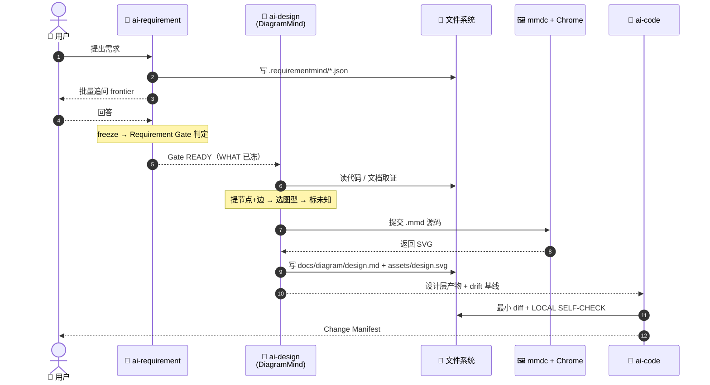

# 调用时序图

> 一次完整的「需求 → 图 → 码」调用链，谁在第几步找谁。

## 说明

- **只有 RM 会问用户**：DiagramMind 与 ai-code 都不问 WHAT（FROZEN 已钉），只做取证与实现。
- **渲染是同步阻塞的**：渲染失败必须回到设计，不允许"只输出源码"蒙混。
- **渲染走 mmdc + 系统 Chrome**：一次 Chrome 启动渲染整批图，源未变则增量跳过（见 `references/render.md`）。
- **产物全部落盘**：不依赖聊天历史，任何一步中断都可从文件恢复。

## 未知项

| # | 问题 | 状态 | 需要 |
|---|------|------|------|
| 1 | ai-code 是否强制消费设计层产物 | 待确认 | 查 `ai-code/SKILL.md` G0 |

## 证据

| 步骤 | 来源 |
|------|------|
| RM 批量追问 | `ai-requirement/SKILL.md` Phase 3 |
| Gate READY | `ai-requirement/SKILL.md` Phase 7 |
| 渲染调用 | `ai-design/scripts/render.mjs`（单 Chrome 批量 + 增量） |
