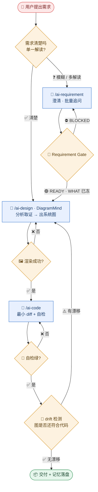

# 业务流程图

> 一条需求从进来到交付，业务上怎么跑（不是代码怎么跑）。

## 说明

- **两条入口**：模糊需求先走澄清，清楚的需求直接进设计 —— 这是 R1（未过 Gate 不开发）的业务表达。
- **三个回流环**：Gate BLOCKED 回澄清、渲染失败回设计、drift 有漂移回设计。回流是常态不是异常。
- **终止条件**：自检绿 + 无漂移，二者缺一不可。
- micro-fix（typo / 唯一解读）可跳过澄清与设计，但必须有一行可证伪的判据。

## 未知项

| # | 问题 | 状态 | 需要 |
|---|------|------|------|
| 1 | 自检"绿"的判定口径 | 已确认 | 见 `shared/verification-policy.yaml` |
| 2 | drift 检测是否进 CI | 未知 | 查 `.github/workflows` |

## 证据

| 节点/边 | 来源 |
|---------|------|
| Gate READY 才开发 | `shared/core.md:14` |
| 回流环 | `shared/core.md:35-40` |
| 验证档位 | `shared/verification-policy.yaml` |
| drift 检测 | `scripts/verify_skill_drift.py` |
