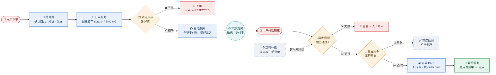

# 用户下单支付全流程

> 一个订单从点击到发货：走哪些服务、状态怎么变、三条失败路径怎么收场。

## 1. 参与方

| 角色 | 类型 | 职责 |
|------|------|------|
| 用户 | 人 | 下单、付款 |
| 结算页 | 前端 | 确认商品/地址/优惠，发起下单 |
| 订单服务 | 内部服务 | **订单状态机唯一写入口** |
| 支付服务 | 内部服务 | 创建支付单、对接三方、处理回调 |
| 履约服务 | 内部服务 | 生成发货单 |
| 三方支付 | 外部系统 | 微信 / 支付宝，资金通道 |

## 2. 状态机

| 状态 | 由谁写 | 后续 |
|------|--------|------|
| `PENDING` | 订单服务（创建） | → `PAID` / `REJECTED` |
| `REJECTED` | 订单服务（锁库存失败） | 终态 |
| `PAID` | 订单服务（回调首次通过） | → 发货 |

**关键不变量**：状态只能由订单服务改，支付服务只发事件 —— 所以幂等必须放在订单服务，不能放支付服务。

## 3. 三条失败路径

| # | 触发 | 处置 | 风险 |
|---|------|------|------|
| 1 | 锁定库存不足 | 直接关单 `REJECTED` | 无（还没资金流） |
| 2 | 回调验签失败 | 告警 + 订单挂起人工介入 | 中：钱已扣、订单没推进 |
| 3 | 超时未收到回调 | 定时任务主动查单补推 | 中：依赖查单接口可用性 |

## 4. 幂等与补偿（为什么必须有）

| 机制 | 位置 | 不加会怎样 |
|------|------|-----------|
| 幂等检查 | 订单服务 · 回调入口 | 三方回调**会重复投递**，库存扣两次 |
| 定时补偿 | 独立任务 · 30s | 回调可能丢失，只靠推送会卡单 |
| 异步发消息 | 订单服务 → MQ | 履约阻塞支付成功响应，用户等半天 |

## 5. 风险

| # | 风险 | 级别 | 影响 | 处置 |
|---|------|------|------|------|
| 1 | 回调重复投递 | 高 | 重复扣库存 / 重复发货 | 幂等键 + 唯一索引 |
| 2 | 验签失败无自动重试 | 中 | 订单挂起需人工 | 告警接入值班 |
| 3 | 扣库存与改状态非原子 | 中 | `PAID` 了但库存没扣 | 本地事务 + 对账任务 |

## 6. 未知 / 待确认

| # | 问题 | 状态 | 需要 |
|---|------|------|------|
| 1 | 锁库存是预占还是冻结 | 未知 | 查库存服务接口文档 |
| 2 | 查单补偿的重试上限 | 未知 | 查定时任务配置 |
| 3 | 履约失败是否回滚订单 | 待确认 | 查履约服务设计 |
