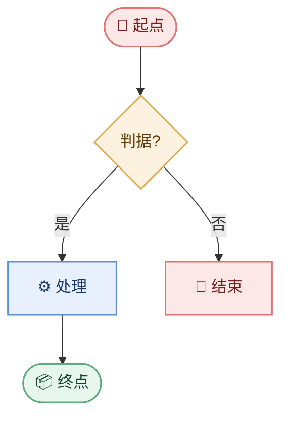

# 查看页测试文档

> 验证横竖 + 主题切换。

```mermaid
flowchart TD
  S(["👤 起点"]):::actor --> C{"判据?"}:::decision
  C -->|"是"| P["⚙️ 处理"]:::step
  C -->|"否"| F["🚫 结束"]:::fail
  P --> E(["📦 终点"]):::done
  classDef actor fill:#fde8e8,stroke:#e07272,color:#7a1f1f,stroke-width:1.5px
  classDef decision fill:#fdf2e0,stroke:#dda94f,color:#5c3c07,stroke-width:1.5px
  classDef step fill:#e8f0fe,stroke:#5b8fd6,color:#173a6b,stroke-width:1.5px
  classDef fail fill:#fde8e8,stroke:#e07272,color:#7a1f1f,stroke-width:1.5px
  classDef done fill:#e6f6ec,stroke:#5aa877,color:#14452a,stroke-width:1.5px
```
