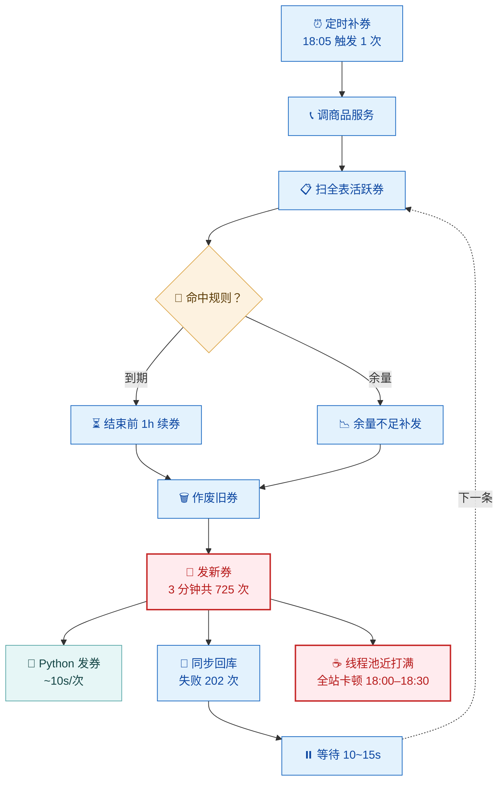

# layout · 构图配方

**配色是皮肤，构图是骨头。** 同一份内容，构图对了像成品，错了像草稿。
下面所有阈值都由 `scripts/render.mjs` 出图后**自动体检**，`--strict` 可让超标直接阻断。

## 一、构图预算（硬指标）

| 指标 | 判据 | 为什么 |
|------|------|--------|
| **画布宽** | **320 ~ 1200px** | 上限：文档里按 900~1200px 显示，1952px 宽的图缩到 900 只剩 **7px** 字。下限：比 320 窄就是一根竖条，连两个框都摆不下 |
| **节点** | ≤12 | 再多没人看 |
| **边** | ≤14 | |
| **主链步数** | ≤8 | 逐步箭头**一步不删**；超过 8 步 → 只画主干，分支与明细进表（`TB` 超 8 层还会塌成竖条） |
| 宽高比 | 0.32 ~ 2.6 | 上限治「横幅」（字号被压小）；下限只兜「塌成竖条」 |
| 填充率 | ≥12% | 节点面积 / 内容包围盒；太低 = 图被拉散 |
| 孤岛空档 | 0 | 图里出现「一大片空地」就是它 |
| 单行标签 | ≤26 字 | 标签越长，画布越宽 |

**纵向长图本身没问题**（文档本来就纵向滚动）—— 别为了凑比例把信息摊平。真正的病是「横太宽」与「窄成竖条」。
**超标的第一动作永远是「砍信息进表」**，不是换主题、不是放大画布。

## 二、mermaid 的三个静默机制（必须知道）

实测（mermaid 11.17.2，同主题）。三条都不报错、不告警，只是默默画歪：

| 写法 | 实测画布 | |
|------|---------|---|
| `subgraph S` + `direction LR` + 只有内部边 | 553 × 172 | 横排 ✅ |
| 同上 + **一条出边到子图外** | 187 × 581 | **LR 被作废，竖堆** ❌ |
| 3 个并列节点、无任何连边 | 273 × 511 | 竖堆 ❌ |
| 同上 + `~~~` 隐形链 | 724 × 329 | 横排 ✅ |
| 9 步链 `flowchart TB` | 144 × 1206 | 144px 宽的竖条 ❌ |
| 9 步链 `flowchart LR` | 1546 × 102 | 横带 ✅（8 层以上会宽到 1600+） |
| 3 条带 + **带间不连边** | 2140 × 247 → r=8.67 | 带被**横排成一条长带** ❌ |
| 3 条带 + **带间连边** | dagre 504×1866 / elk 431×1502 | 全塌成竖条（**两引擎一致**）❌ |

**三条结论：**

1. **跨 subgraph 的边会让全图 `direction` 失效**（隐形 `~~~` 跨边界同样会）；反过来，带间**不**连边 → 各带被当成互不相干的组件，**随机横排**。
   ⇒ **「分带 + 带间流动」在 mermaid 里做不出来。别再试。**
2. **并列节点必须显式连起来**才横排（`A ~~~ B ~~~ C`），否则 dagre 竖着堆。
3. **方向决定形状**：`LR` 是横河，`TB` 是竖河。**横河的「层数」直接换成宽度**（每层 ≈150px），所以 `LR` 单行最多 **6~7 层**（≈1200px）。

## 三、主推构图：垂直主链 + 侧挂锚点

**一条竖河往下走，锚点挂在出事那一层的旁边。** 流程类 / 问题类的主力构图，实测最稳。

关键技巧：**让锚点和它的「兄弟」同层** —— 给两者一个共同的上游节点，dagre 就会把它们摆到同一层、左右并排。

实测：**676×1354 · r=0.50 · 12 节点 · 13 边 · 填充 17% · 审计全绿**。

- `F7 --> F7B` 与 `F7 --> B1` 让 `F7B / F8 / B1` 落在**同一层** → 瓶颈那层自然撑宽，一眼看到「发新券同时占住 Python 车道和线程池」。
- 回环用虚线 `-.->` 走外侧，不穿框。
- **锚点 ≤2 个**，其余全进表。
- 分支（`F4 -->|到期| F5` + `F4 -->|余量| F5B`）天然并排，顺手把宽度撑起来。

**什么时候可以用 subgraph 分带**：只当带内**没有跨带流动**、且你只要「分组视觉」时（如并列的三种方案）。**一旦带间要有箭头，就回到竖河。**

## 四、方向与图型选择

| 内容 | 怎么写 |
|------|--------|
| 3~6 步顺序流程、无分支 | `flowchart LR` 横河 |
| **7 步以上 / 有分支 / 带问题锚点** | **`flowchart TB` 竖河 + 侧挂锚点（第三节）** |
| 谁依赖谁、分层架构 | `architecture-beta`（自带图标，也不吃带的方向问题） |
| 调用链 / 状态 / 数据模型 | `sequenceDiagram` / `stateDiagram-v2` / `erDiagram` |
| 20+ 步 | **别画成一张图**：只画主干，分支与明细进表 |

## 五、层次（让它「好看」）

三级字阶，主题里已定好，照用即可：

| 层 | 规格 | 谁 |
|----|------|----|
| 带 / 分组标题 | 15px / 600 | subgraph 标签 |
| 节点主标签 | 15px / 400 | 业务动作 |
| 节点副标题 | 13px / 400 次要色 | `…` |
| 边注 | 13px | 边上的动词 |

- 节点圆角 8 + 极浅投影；**`classDef` 只给关键节点**（症状 / 瓶颈 / 对策 / 排除项），普通步骤共用一色 —— 全上色等于没上色。
- 箭头统一 `-->`；虚线只给「否定 / 对策 / 回环」；边标动词，别标方法名。
- 副标题承载「跨不了边/进不了图的信息」：数字、量级、`← 见 ②` 这类指路。

## 六、ELK（备选，别当默认）

`--layout auto|dagre|elk`：

- **auto（默认）**：dagre 先算；**审计不达标才**追加一次 elk，取违规少者。达标时零额外成本。
- 实测：同一份 26 节点 DSL，dagre 1952×2319（右半全空）→ elk **935×2123**（留白归零）；但**跨子图方向问题上 elk 与 dagre 一样塌**（第二节表）。
- 代价：elk 会打乱阅读顺序（主链绕行、cluster 框易错位）。它治「留白」不治「看不懂」。
- 判据：**先砍信息**；砍完还超标，再让 auto 去试 elk。

## 七、出图前自查

- [ ] 节点 ≤12、边 ≤14
- [ ] 主链一步不删、每步一个箭头（流程链不可删）
- [ ] 数字只留 1~2 个最关键的，其余进 §关键数字
- [ ] 锚点 ≤2 个且挂在出事那一层旁边；没有独立的「对策 subgraph」
- [ ] 图里没有类名 / `path:line` / 表字段
- [ ] 图块里没有 `<尖括号>`
- [ ] `node scripts/render.mjs <目录> --strict` 全绿
