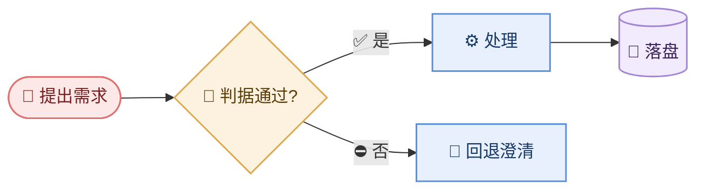

# mermaid · DSL 生成规则

**构图（方向/带/预算/ELK）在 `layout.md`，本页只管 DSL 怎么写对。** 画歪的图 90% 是构图问题不是语法问题。

## 图说人话（先于一切硬规则）

**节点标签 = 给非开发读者看的业务语言。** 代码锚点一律进 `design.md` 的 **§0 节点证据表**，不进图。

| ❌ 图里禁止 | ✅ 图里应写 | 证据放哪 |
|------------|------------|---------|
| `CouponTask.java:61` | `⏰ 18:05 定时任务` | §0 节点证据表 |
| `listForCouponSendTask` | `查待补券规则列表` | §0 + §3 命令/接口 |
| `sendLiveCoupon` | `向抖音发直播券` | §0 |
| `HttpBuyinApiHelper:801` | 边标 `调用发券服务` | §0 |
| `t_coupon_douyin` | `券记录入库` | §0 + 工件链 |

**双行标签格式**：`动作/角色<br/>〔可选：一个关键事实〕` —— 副标题是人话；**有可信数字/态才写**，无则省略第二行。见 `annotation.md`。
副标题想降一级配色 → `"标题<br/><span class='s'>副标题</span>"`（主题已定义 13px 次要色）。

## 硬规则

1. **首行必写图型**：`flowchart TD` / `sequenceDiagram` / `stateDiagram-v2` / `erDiagram` / `architecture-beta`。
2. **节点 ID 用 ASCII**，显示名放 `[]`：`PaySvc[支付服务]`。ID 含空格/中文/`()`/`-` 必炸。
3. **中文显示名加引号**：`A["支付服务(新)"]`。含 `()[]{}"` 一律加 `"`。
4. **边标动词**：`A -->|触发| B` / `A -->|写入| DB`。禁裸方法名/URL。
5. **`<br/>` 只用于双行标签**（`标题<br/>副标题`），不用于堆段落。长文本拆节点。
6. **先定方向与带，再写节点**：3~9 步顺序流程走 `LR`；分带必须带内自洽、**带间不连边**（跨带边会让 `direction` 全部静默失效）。细则 `layout.md`。

## 语义配色（`classDef`）

**只给关键节点上色**（症状/瓶颈/对策/排除项）；普通步骤共用一色 —— 全上色等于没上色。

### 排查态（仅 D0 勾选「排查态」时用）

```mermaid
  classDef confirmed fill:#ffebee,stroke:#c62828,color:#b71c1c,stroke-width:2px
  classDef suspect   fill:#fff3e0,stroke:#ef6c00,color:#e65100,stroke-dasharray:4 3
  classDef denied    fill:#eceff1,stroke:#94a3b8,color:#546e7a,stroke-dasharray:4 3
  classDef symptom   fill:#fff9c4,stroke:#f9a825,color:#e65100
  classDef metric    fill:#e3f2fd,stroke:#1565c0,color:#0d47a1
```

未做排查 → **不要**引用这套 classDef。

### 流程 + 对策配色（问题类常用）

```mermaid
  classDef flow       fill:#e3f2fd,stroke:#1565c0,color:#0d47a1
  classDef bottleneck fill:#ffebee,stroke:#c62828,color:#b71c1c,stroke-width:2px
  classDef remedy     fill:#e8f5e9,stroke:#2e7d32,color:#1b5e20,stroke-dasharray:4 3
```

- **flow**：业务流程每一步（主链，不可删）
- **bottleneck**：流程上已证实的堵点
- **remedy**：对策概要；边上可标 `322/min→≤cap` 等量级，细则见 `annotation.md`

### 完整配色板（复制即用）

```mermaid
  classDef actor   fill:#fde8e8,stroke:#e07272,color:#7a1f1f,stroke-width:1.5px
  classDef entry   fill:#e8f0fe,stroke:#5b8fd6,color:#173a6b,stroke-width:1.5px
  classDef core    fill:#e6f6ec,stroke:#5aa877,color:#14452a,stroke-width:1.5px
  classDef out     fill:#fdf2e0,stroke:#dda94f,color:#5c3c07,stroke-width:1.5px
  classDef store   fill:#f2eafd,stroke:#a184d6,color:#3a2159,stroke-width:1.5px
  classDef risk    fill:#fde8e8,stroke:#e07272,color:#7a1f1f,stroke-width:1.5px
  classDef unknown fill:#eef1f6,stroke:#94a3b8,color:#334155,stroke-width:1.5px,stroke-dasharray:4 3
```

用法：`S["⚙️ 五层流水线"]:::core`，或 `class A,B core`。

## 决策：图还是表

| 内容 | 用什么 |
|------|--------|
| 拓扑 / 依赖 / 层次 / 主链 | **图** |
| 清单 / 映射 / 判据 / 数字明细 / 排除项 / 对策清单 | **表格**（风险、决策、验收都属于这类，别出图） |

## 形状语义（统一，别乱用）

| 写法 | 含义 | 用在哪 |
|------|------|--------|
| `A[名]` | 服务/模块 | 通用 |
| `A[(名)]` | 存储/DB | 数据 |
| `A{名}` | 判断 | 分支 |
| `A(["名"])` | 角色/起止 | 边界 |
| `A((名))` | 外部系统 | 边界 |

## 模板（复制改）

### architecture-beta 分层架构（首选）


### flowchart 业务主链


**垂直主链 + 侧挂锚点**（默认构图）、**并列节点隐形链**、**分支并排** → `layout.md` 第三节有完整可拷样例。
时序 / 状态 / ER 成品 → `templates/` 与 `evals/samples/`。

> ⚠️ **别用 subgraph 分带**：带间一旦有箭头，全图的 `direction` 会静默失效、塌成竖条；带间若无箭头，各带会被随机横排。细则见 `layout.md` 第二节实测表。

## 陷阱清单

| 症状 | 根因 | 修 |
|------|------|-----|
| 标签里的内容凭空消失 / 排版错乱 | 图块里写了尖括号 —— `flowchart` 开了 `htmlLabels`，`<x>` 会被当 HTML 标签吃掉 | 图块里除 `<br/>`/`<span>` 外**禁用尖括号**（表格/正文里随便用）；`lint.mjs` P05 会拦 |
| 图不渲染/报错 | ID 含中文或空格 | ID 改 ASCII，名放 `[]` |
| 文字被截断 | 名里有 `()` 未加引号 | 整个名加 `"` |
| 节点乱飞 | 未声明方向 | 首行加 `TD`/`LR` |
| **右半边一大片空** | dagre 把某节点推到远处 | 跑 `--strict` 看审计；或 `--layout auto`（会试 elk） |
| **`direction LR` 却竖排** | 该子图有边跨出边界 → direction 静默作废 | 带内自洽、带间不连边（`layout.md` 第二节） |
| **并列节点竖着堆** | 它们之间没有任何边 | 用 `A ~~~ B ~~~ C` 隐形链串起来 |
| **整张图塌成一条竖线** | 长链用了 `TB` | 长链走 `flowchart LR`，或按阶段分带 |
| **字太小看不清** | 画布宽 >1200px，文档里被等比缩小 | 砍节点进表；审计会直接报宽度 |
| `end` 报错 | 用了保留字 `end`/`graph` | 改名或加引号 |
| `Diagrams beginning with --- are not valid` | 从 HTML/文档抽源码没 dedent | 去掉 front-matter 缩进 |
| 架构图还是紫色 | `architecture-beta` 不吃通用变量 | 主题里补 `archEdgeColor`/`archGroupBorderColor` |
| 观感像草稿 | 没走主题 / 关键节点没上色 | 别加 `--theme none`；补 `classDef` |

## 渲染

```bash
node scripts/render.mjs docs/diagram/ --strict   # 目录批量（单 Chrome + 增量 + 构图审计）
node scripts/render.mjs in.mmd out.svg           # 单文件
```
