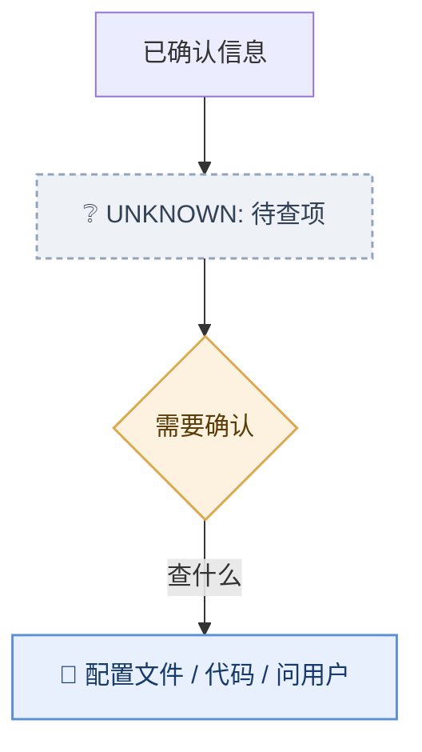

# unknowns-risks · 不确定信息与风险标记

**核心纪律：不确定就标出来，不许猜。** 猜错的图比没有图更危险——它会让新人和 Agent 建立错误心智模型。

## 未知处理（D4）

三类信息分开落：

| 类型 | 定义 | 落哪 |
|------|------|------|
| 已确认 | 有 `path:line` 或需求原话证据 | 主图节点/边 |
| 未知 | 查不到、需求没写、无法取证 | 图内 `UNKNOWN` 节点 + 未知清单 |
| 待确认 | 有合理推测但无字面量 | 图内节点标 `?` + 待确认清单 |

### UNKNOWN 节点画法



未知节点用**虚线框**（`stroke-dasharray`）—— 视觉上就宣告「这里没确定」，比文字更早被注意到。

### 未知清单格式（文档正文，不是图里）

```
## 未知 / 待确认
| # | 问题 | 状态 | 需要 |
|---|------|------|------|
| 1 | Redis 是否参与缓存 | 未知 | 查 config/*.yml |
| 2 | 支付回调是否幂等 | 待确认 | 查 PayCallback.java |
```

**禁止**：把猜测画成确定节点；用"应该是/大概是"填充图。

## 风险：用表格，不出图

风险是**清单**，不是拓扑。为它单独开一张图既浪费篇幅又没人看。

```
## 风险
| # | 风险 | 级别 | 证据 | 影响 | 处置 |
|---|------|------|------|------|------|
| 1 | 主库单点 | 高 | deploy/db.yml:12 | 全站不可用 | 加备库 |
```

`风险` 与 `未知` 分两张表 —— 前者是**已知的坑**，后者是**还没查清的事**，别混。

## 级别判据

| 级别 | 判据 |
|------|------|
| 高 | 会导致数据丢失 / 不可用 / 安全漏洞 |
| 中 | 影响部分功能 / 需人工介入 |
| 低 | 体验/维护性问题 |

## 出口检查

- [ ] 每个节点/边都能追到证据？
- [ ] 所有查不到的都进了未知清单，且**没有**被画成确定节点？
- [ ] 风险是**表格**形态，且有级别+证据+处置？
- [ ] 图里没有"应该/可能/大概"这类词？
- [ ] 未知节点用了虚线框？
