# <系统名> 架构

> 分层看：谁依赖谁，契约在哪一层。

## 说明

- **分层依据**：〔为什么这么切，例如按变更频率 / 按部署单元〕
- **依赖方向**：〔只能从上往下？有没有反向依赖？〕
- **契约位置**：〔接口定义在哪个模块，谁有权改〕

## 未知 / 待确认

| # | 问题 | 状态 | 需要 |
|---|------|------|------|
| 1 | 〔问题〕 | 未知 | 〔查什么〕 |

## 证据

| 节点 | 来源 |
|------|------|
| 〔API〕 | 〔src/api/...:1〕 |

---

<!-- 图型要点
  · 图标：cloud / server / database / disk / internet —— 只能用小括号 (icon)
  · 分组：group <id>(cloud)[<标题>]     ← 这里的尖括号是**语法**，不是占位符
  · 边方向必须写 L/R/T/B：a:R -- L:b 表示 a 的右边接 b 的左边
  · 这套图型不吃通用 themeVariables，主题里已单独配 archEdgeColor / archGroupBorderColor
  · 标签里不要放 <尖括号>，会被当 HTML 标签吃掉；占位用 〔〕
  · 超过 25 个节点就拆成多份文档
-->
