# <系统名> 技术设计

> <一句话：这是什么、给谁用、解决什么问题。>




## 0. 节点证据（有锚点时必填）

| 图节点/边 | 证据 |
|-----------|------|
| 〔人话节点名〕 | 〔path:line / 日志 / 需求原话〕 |

<!-- 以下整节「有则保留、无则删除」，禁止留空表 -->

## 关键数字

| 指标 | 值 | 时段/条件 | 来源 |
|------|-----|----------|------|
| 〔…〕 | 〔…〕 | 〔…〕 | 〔…〕 |

## 排查脉络

| 态 | 项 | 依据 | 图上节点 |
|----|-----|------|---------|
| 确定 / 怀疑 / 否定 / 未知 | 〔…〕 | 〔…〕 | 〔…〕 |

## 解决方案

| 问题 | 现状 | 对策概要 | 预期效果（待验证） | 优先级 |
|------|------|---------|-------------------|--------|
| 〔图上瓶颈/问题〕 | 〔有据数字〕 | 〔一句话〕 | 〔如 100→20 次/min〕 | P0/P1 |

## 1. 分层职责

| 层 | 谁 | 只做 | 不碰 |
|----|----|------|------|
| 接入层 | 〔网关 / 鉴权〕 | 〔鉴权、限流、路由〕 | 业务逻辑 |
| 核心层 | 〔核心服务〕 | 〔领域逻辑 + 状态机唯一写入口〕 | 直接对外暴露 |
| 数据层 | 〔库 / 缓存〕 | 持久化 | 业务规则 |

**核心不变量**：〔写清楚哪条规则不能破，例如「状态只能由 X 改」〕。

## 2. 工件链（下游直接消费）

| # | 生产者 | 工件 | 落盘位置 | 消费者 |
|---|--------|------|----------|--------|
| 1 | 〔谁〕 | 〔什么〕 | 〔路径〕 | 〔谁〕 |
| 2 | 〔谁〕 | 〔什么〕 | 〔路径〕 | 〔谁〕 |

## 3. 命令 / 接口

| 命令 / 接口 | 作用 | 何时用 |
|-------------|------|--------|
| 〔cmd〕 | 〔作用〕 | 〔时机〕 |

## 4. 风险

| # | 风险 | 级别 | 影响 | 处置 |
|---|------|------|------|------|
| 1 | 〔风险〕 | 高 / 中 / 低 | 〔影响〕 | 〔处置〕 |

## 5. 未知 / 待确认

| # | 问题 | 状态 | 需要 |
|---|------|------|------|
| 1 | 〔问题〕 | 未知 / 待确认 | 〔查什么〕 |

## 6. 验收

| # | 判据（可 TDD 化） | 证据 |
|---|------------------|------|
| 1 | 〔func('in') == 'out'〕 | 待跑 |

```yaml
变更面: 〔改哪一层 / 哪个模块〕
plan路径: "@docs/diagram/design.md"
范围: 〔模块X 表Y 接口Z〕
验收: 验收表 #1-#1
验证档位: surface
建议下一步: /ai-code
```

---

<!-- 用法
  1. 全文把 〔...〕 换成你的内容；<尖括号> 在表格/正文里随便用，但**图块里不能用** ——
     flowchart 开了 htmlLabels，标签里的 <x> 会被当 HTML 标签吃掉。
  2. **图块标签用人话**；类名/path:line 只写 §0；数字/排查态按 annotation.md **按需**，无则省略。
  3. 图须含**业务流程主链**（逐步箭头，一步不删）；**对策默认不进图**，明细进表。
     构图默认「**垂直主链 + 侧挂锚点**」（`flowchart TB`，锚点与兄弟节点同层）；
     预算：节点 ≤12 · 边 ≤14 · 画布宽 320~1200px —— 细则 `references/layout.md`；
     交付前 `node scripts/render.mjs docs/diagram/ --strict` 必须全绿。
  4. §关键数字、§排查脉络、§解决方案 — 用不上就**删整节**。
  4. 图块必须是本文档**唯一**的 mermaid 块，render.mjs 只渲第一个。
  4. 渲染：node scripts/render.mjs docs/diagram/
     查看页：node scripts/viewer.mjs docs/diagram/design.md   （横竖 + 主题可切换）
-->
