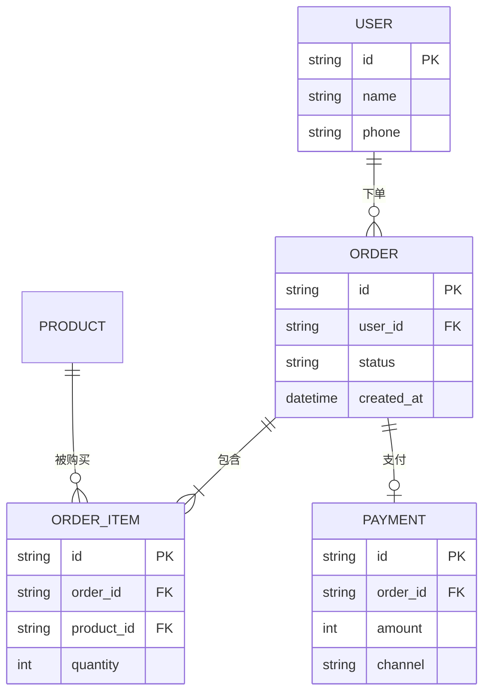

# <系统名> 数据模型

> 有哪些实体、怎么关联、基数是什么。

## 关系说明

| 关系 | 基数 | 含义 | 约束 |
|------|------|------|------|
| USER → ORDER | 1:N | 一个用户多笔订单 | 〔外键 / 软关联〕 |
| ORDER → ORDER_ITEM | 1:N | 一笔订单多个商品 | 〔级联删除？〕 |
| ORDER → PAYMENT | 1:0..1 | 一笔订单最多一笔有效支付 | 〔唯一索引〕 |

## 说明

- **真源**：〔哪张表是权威，有没有冗余副本〕
- **状态字段**：〔`status` 的取值集合与流转规则 → 见状态机图〕
- **迁移策略**：〔加字段 / 改类型怎么上线〕

## 未知 / 待确认

| # | 问题 | 状态 | 需要 |
|---|------|------|------|
| 1 | 〔问题〕 | 未知 | 〔查什么〕 |

## 证据

| 实体 | 来源 |
|------|------|
| 〔ORDER〕 | 〔migrations/...:1〕 |

---

<!-- 图型要点
  · 基数记法：|| 恰好一个、o| 零或一个、}o 零或多、}| 一或多
    例：A ||--o{ B  读作「A 恰好一个 对 B 零或多个」
  · 实体块里写字段：类型 名字 [PK|FK]，不写约束细节（放关系表里）
  · 字段多的大表只列关键字段，别把 30 个列全塞进去
  · 实体超 12 个 → 按域拆文档
-->
