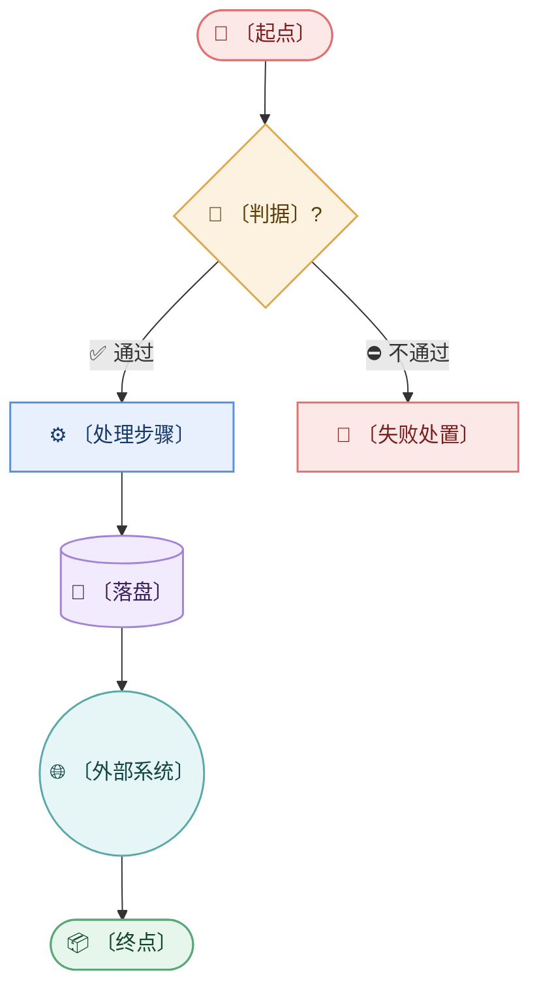

# <流程名>

> 业务上怎么跑（不是代码怎么跑）。<一句话说清起点和终点。>

## 说明

- **入口条件**：〔什么情况下会走到这条流程〕
- **回流环**：〔哪几步可能退回，退回的判据是什么〕
- **终止条件**：〔什么状态算真的结束〕

## 失败路径

| # | 触发 | 处置 | 残留风险 |
|---|------|------|----------|
| 1 | 〔触发条件〕 | 〔怎么收场〕 | 〔有没有脏数据 / 需要人工〕 |

## 未知 / 待确认

| # | 问题 | 状态 | 需要 |
|---|------|------|------|
| 1 | 〔问题〕 | 未知 | 〔查什么〕 |

---

<!-- 图型要点
  · 首行写 flowchart TD（竖排）或 LR（横排）；viewer.mjs 支持一键切换
  · 形状语义：(["角色/起止"]) [(存储)] {"判断"} (("外部")) ["步骤"]
  · 双行标签用  （这是允许的），但别放 <尖括号> 文字 —— htmlLabels 会吃掉它
  · 占位统一用 〔〕
  · 节点超 25 个 → 拆文档
  · 边一律标语义：A -->|"调用"| B
-->
