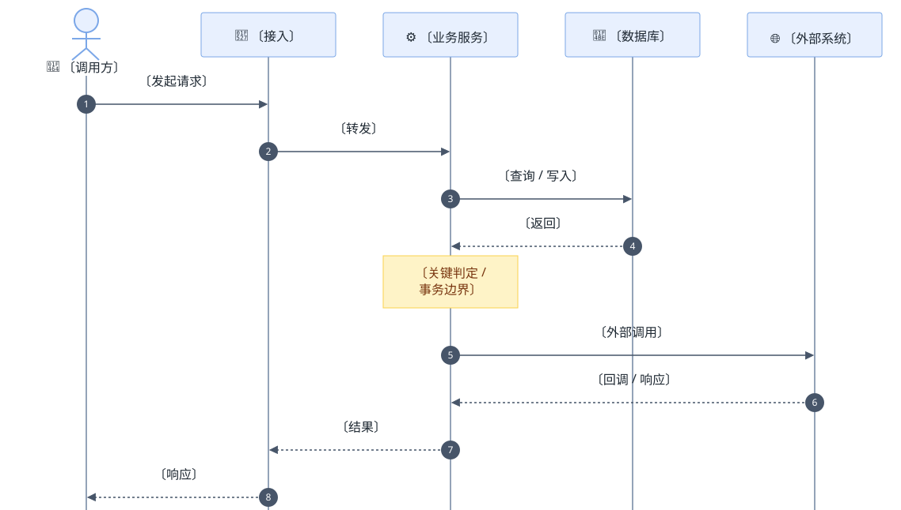
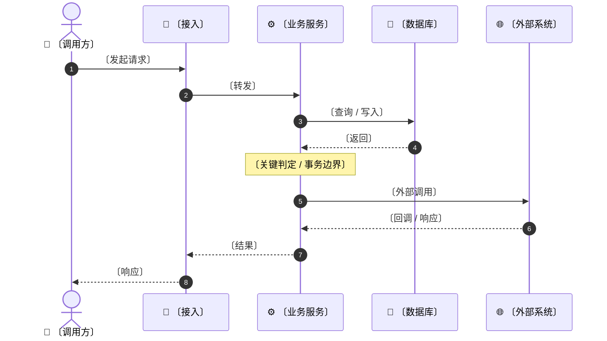

# <链路名> 调用时序

> 一次请求从头到尾，谁在第几步找谁。

## 说明

- **同步 vs 异步**：〔哪几步是阻塞的，哪几步走消息〕
- **事务边界**：〔从哪到哪在一个事务里〕
- **失败回滚**：〔第几步失败要回滚哪些步骤〕
- **幂等点**：〔哪个入口可能被重复调用〕

## 未知 / 待确认

| # | 问题 | 状态 | 需要 |
|---|------|------|------|
| 1 | 〔问题〕 | 未知 | 〔查什么〕 |

## 证据

| 步骤 | 来源 |
|------|------|
| 〔调用〕 | 〔src/...:1〕 |

---

<!-- 图型要点
  · participant 起别名用 as；actor 画小人图标
  · 实线 ->> 同步调用；虚线 -->> 返回
  · Note over 用来标事务边界 / 关键判定，别写成一段话
  · 时序图没有分支语义 —— 有 if/else 就该改用 flowchart
  · 不需要 classDef：主题已统一配色
-->
