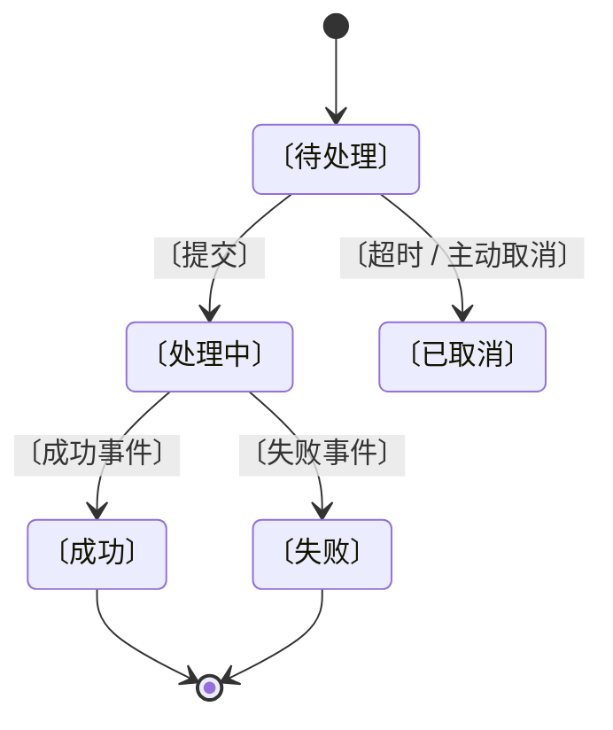

# <对象名> 状态机

> 一个〔对象〕从生到死能处于哪些状态、靠什么事件跳转。

## 状态表

| 状态 | 由谁写 | 触发事件 | 后续 |
|------|--------|----------|------|
| 〔待处理〕 | 〔谁〕 | 创建 | → 〔处理中〕 / 〔已取消〕 |
| 〔处理中〕 | 〔谁〕 | 〔事件〕 | → 〔成功〕 / 〔失败〕 |
| 〔成功〕 | 〔谁〕 | — | 终态 |

**唯一写入口**：状态只能由〔谁〕改，〔谁〕只发事件 —— 这条不变量决定了幂等该放在哪。

## 说明

- **非法跳转**：〔哪些组合不允许，靠什么拦住〕
- **终态**：〔哪些是终态，终态能不能复活〕

## 未知 / 待确认

| # | 问题 | 状态 | 需要 |
|---|------|------|------|
| 1 | 〔问题〕 | 未知 | 〔查什么〕 |

---

<!-- 图型要点
  · [*] 是起点 / 终点，两处都用它
  · 转移线写 "--> 目标态: 事件名"，事件名必填 —— 没有事件的转移说明设计有问题
  · 状态名含中文/空格是允许的（和 flowchart 的 ID 规则不同）
  · 状态约束多的话加：note right of 〔处理中〕 ... end note
  · 占位统一用 〔〕，别用 <尖括号>
-->
